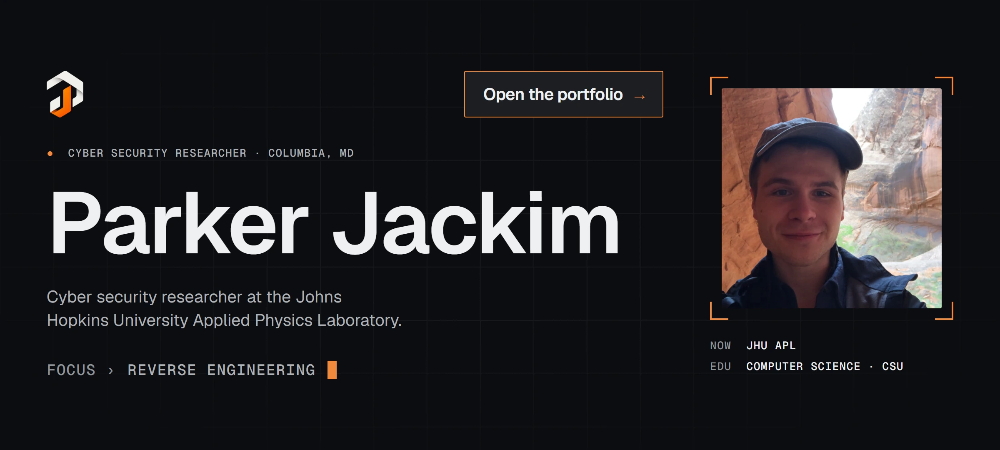
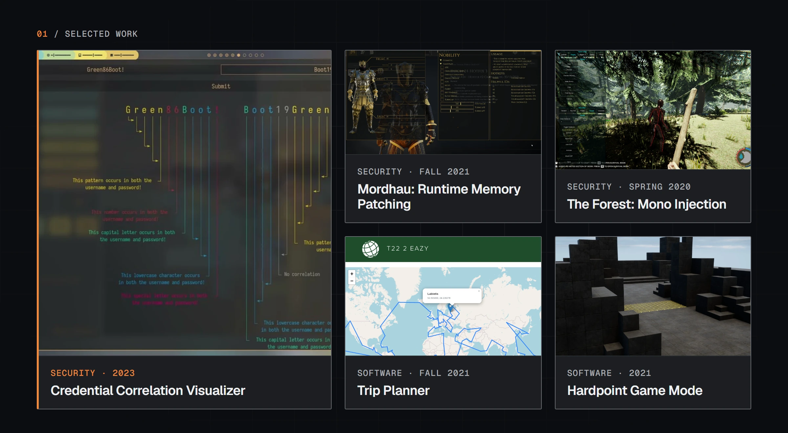
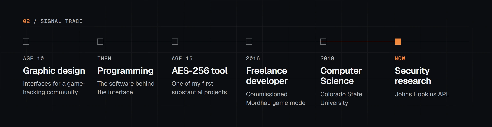

 

**[Portfolio](https://pjackim.github.io/Portfolio/)** &nbsp;·&nbsp; [Résumé](https://pjackim.github.io/Portfolio/files/Resume_General.pdf) &nbsp;·&nbsp; [GitHub](https://github.com/pjackim) &nbsp;·&nbsp; [LinkedIn](https://www.linkedin.com/in/parker-jackim-68b3561b8/) &nbsp;·&nbsp; [Email](mailto:parkerwjackim@gmail.com)

Built with Astro · <a href="docs/DEVELOPMENT.md">how it's made</a>

